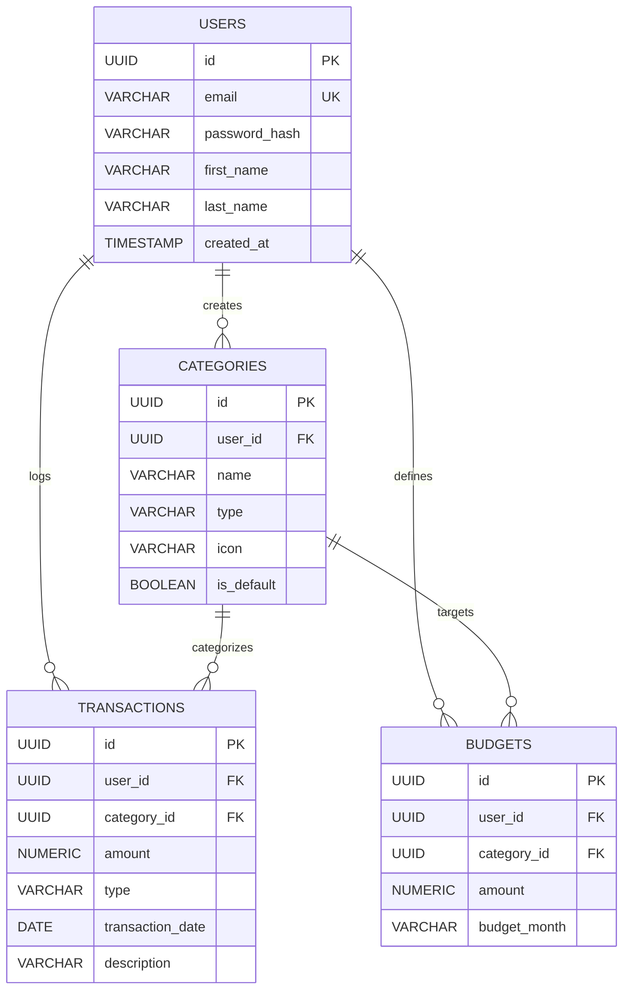

# FinTrack - Personal Finance Manager

[](https://github.com/abrahem-salhab/Personal-Finance-Manager/actions/workflows/ci.yml)
[](https://openjdk.org/)
[](https://spring.io/projects/spring-boot)
[](https://www.postgresql.org/)
[](https://react.dev/)
[](https://www.typescriptlang.org/)
[](https://tailwindcss.com/)

A production-grade, full-stack Personal Finance Manager built with **Java (Spring Boot)** and **React (TypeScript)**, featuring JWT authentication, automated Flyway migrations, monthly budget enforcement, financial telemetry, dynamic trend analytics, and direct CSV/PDF report exports.

Designed and styled according to a **Content-First** design system with **FinTrack** branding.

---

## 📌 Project Overview
**FinTrack (Personal Finance Manager)** is engineered to give users control over their financial health through an intuitive interface. It solves the friction of traditional personal bookkeeping through:
1. Fast ledger entry and real-time category distribution.
2. Hard & soft monthly budget caps with color-coded alerts (Green / Orange / Red).
3. Live trend charts showing income vs. expense velocity over 6 to 12 months.
4. Instant one-click exports to CSV and PDF statements.

---

## 🚀 Features

- **Authentication & Security:**
  - Stateless JWT Bearer token authentication with 24h expiration.
  - BCrypt password encryption.
  - Automatic seeding of 14 default categories (Groceries, Dining, Salary, Rent, Investments, etc.) upon user registration.
  - User-scoped queries preventing Insecure Direct Object References (IDOR).
- **Transaction Ledger:**
  - Full CRUD operations on income and expense items.
  - Multi-criteria filtering (Type, Category, Date range, full-text description search).
  - Server-side pagination and custom sorting.
- **Monthly Budgets:**
  - Monthly targets defined per category or as an overall cap.
  - Dynamic spending calculations, remaining balances, and progress bar thresholds.
  - Overrun warnings when spending exceeds limits.
- **Reports & Analytics:**
  - Cash flow breakdown and savings rate calculation.
  - Interactive SVG trend charts.
  - Downloadable CSV spreadsheets (via Apache Commons CSV).
  - Formatted PDF statements (via OpenPDF).
- **Design System & UX:**
  - Built with a modern **Content-First** design system (#FF0000 Broadcast Red, #0F0F0F Near Black, #F2F2F2 Surface).
  - Collapsible navigation rail (72px to 240px) and sticky top bar (56px).
  - Custom vector FinTrack branding and responsive layout.

---

## 🛠 Tech Stack

### Backend
- **Language:** Java 17+ (Java 26 compatible)
- **Framework:** Spring Boot, Spring Web, Spring Security, Spring Data JPA
- **Database:** PostgreSQL (with H2 in-memory test/fallback profile)
- **Migrations:** Flyway
- **Security:** JJWT (`io.jsonwebtoken 0.12.6`), BCrypt
- **Export Engines:** OpenPDF (`com.github.librepdf:openpdf 1.3.43`), Apache Commons CSV
- **API Documentation:** Springdoc OpenAPI & Swagger UI 3
- **Testing:** JUnit 5, Mockito, Spring Boot Test

### Frontend
- **Framework:** React 19, TypeScript, Vite
- **Styling:** Tailwind CSS v4 (`@tailwindcss/vite`), Custom Design System Tokens
- **Routing:** React Router DOM v7
- **Icons:** Lucide React
- **Brand Assets:** FinTrack custom SVG vector illustrations

### DevOps & Tooling
- Docker & Docker Compose
- Nginx (production SPA static file server & API reverse proxy)
- GitHub Actions CI Pipeline

---

## 📐 Architecture & Database Design

### System Architecture
```text
Browser / Client (React 19 + TypeScript)
                        │
                        ▼ (HTTP / REST)
       Spring Boot 3/4 Application Server
      ┌────────────────────────────────────┐
      │  Security Filter (JWT Validation)  │
      │  Controllers (REST / OpenAPI)      │
      │  Services (Business & Financial)   │
      │  Repositories (Spring Data JPA)    │
      └─────────────────┬──────────────────┘
                        │
                        ▼ (JDBC)
              PostgreSQL Database
```

### Database Entity-Relationship Diagram (ERD)



---

## 🔌 API Overview

Interactive Swagger UI documentation is available at:
`http://localhost:8080/swagger-ui/index.html`

| Method | Endpoint | Description | Auth Required |
|---|---|---|---|
| `POST` | `/api/v1/auth/register` | Register new user & seed default categories | No |
| `POST` | `/api/v1/auth/login` | Login & receive Bearer JWT token | No |
| `GET` | `/api/v1/auth/me` | Fetch authenticated user profile | Yes |
| `GET` | `/api/v1/categories` | Retrieve available categories | Yes |
| `POST` | `/api/v1/categories` | Create custom category | Yes |
| `DELETE` | `/api/v1/categories/{id}` | Delete custom category | Yes |
| `GET` | `/api/v1/transactions` | Paginated & filtered transaction ledger | Yes |
| `POST` | `/api/v1/transactions` | Record new transaction | Yes |
| `PUT` | `/api/v1/transactions/{id}` | Update existing transaction | Yes |
| `DELETE` | `/api/v1/transactions/{id}` | Delete transaction | Yes |
| `GET` | `/api/v1/budgets` | Fetch monthly budgets & spending progress | Yes |
| `POST` | `/api/v1/budgets` | Create or update budget cap | Yes |
| `DELETE` | `/api/v1/budgets/{id}` | Remove budget cap | Yes |
| `GET` | `/api/v1/reports/summary` | High-level cash flow summary | Yes |
| `GET` | `/api/v1/reports/monthly-trend` | 6/12 month trend data | Yes |
| `GET` | `/api/v1/reports/export/csv` | Export statement to CSV | Yes |
| `GET` | `/api/v1/reports/export/pdf` | Export statement to PDF | Yes |

---

## 💻 Local Development Setup

### Prerequisites
- Java 17 or higher
- Node.js 20 or higher & npm
- PostgreSQL 15+ (optional: app defaults to in-memory H2 if no local Postgres is active)

### 1. Run the Backend
```bash
cd backend
# Windows:
.\mvnw.cmd spring-boot:run -Dspring-boot.run.profiles=dev
# Linux/macOS:
./mvnw spring-boot:run -Dspring-boot.run.profiles=dev
```
The backend API will start on `http://localhost:8080`.

### 2. Run the Frontend
```bash
cd frontend
npm install
npm run dev
```
The client application will start on `http://localhost:5173`.

---

## 🧪 Running Automated Tests

### Backend Unit & Integration Tests
```bash
cd backend
# Windows:
.\mvnw.cmd test
# Linux/macOS:
./mvnw test
```
All 11 unit and integration tests (Spring Boot test context, AuthService, TransactionService, ReportService, CSV/PDF generators) run with 100% pass rate.

### Frontend TypeScript Verification & Build
```bash
cd frontend
npm run build
```

---

## 🐳 Docker Deployment

To launch the entire stack (PostgreSQL + Spring Boot + React + Nginx) with a single command:

```bash
docker compose up --build -d
```

- Frontend App: `http://localhost`
- Backend API: `http://localhost:8080`
- Swagger UI: `http://localhost:8080/swagger-ui/index.html`

---

## ⚖️ Architectural Decisions & Trade-offs

1. **Modular Monolith vs Microservices:**
   A modular monolith was chosen to avoid the overhead of distributed transactions and service meshes while keeping clean domain boundaries.
2. **Stateless JWT vs Sessions:**
   Stateless Bearer JWTs enable horizontal container scaling and eliminate sticky session dependencies.
3. **OpenPDF & Commons CSV for Server-side Exports:**
   Exporting PDFs and CSVs server-side guarantees consistency across devices and operating systems.
4. **Tailwind CSS v4 + Design System:**
   Tailwind v4 delivers faster compilation times without extra configuration files, paired with high-contrast accessibility tokens.

---

## 👤 Author
- **Developer:** Abrahem Salhab
- **Email:** ibrahimsalhab18@gmail.com
- **GitHub:** [abrahem-salhab](https://github.com/abrahem-salhab)
