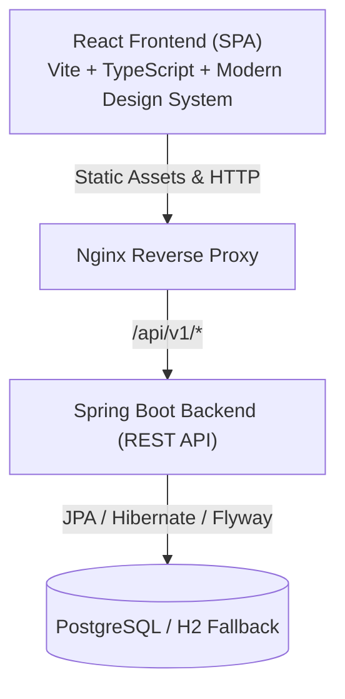

# Architecture Documentation

## System Overview
The **Personal Finance Manager** (FinTrack) is designed as a **Modular Monolith** backend paired with a **Single Page Application (SPA)** frontend, tailored for high developer velocity, clear domain separation, and enterprise robustness.



## Backend Architecture
The backend follows strict **Layered Clean Architecture**:

```text
Controller (HTTP / REST / OpenAPI / Validation)
   ↓
Service (Business Logic / Orchestration / Security Context)
   ↓
Repository (Spring Data JPA / Queries / Projections)
   ↓
PostgreSQL Database
```

### Module Boundaries
- **Authentication & Security (`com.finance.pfm.security` & `com.finance.pfm.service.AuthService`)**:
  - Stateless Bearer JWT tokens.
  - BCrypt password hashing.
  - Automatically seeds 14 default financial categories upon user registration.
- **Transactions (`com.finance.pfm.service.TransactionService`)**:
  - Full CRUD operations with user-scoped isolation (IDOR protection).
  - Multi-parameter filtering (date range, type, category, full-text description query).
  - Pageable responses with metadata.
- **Budgets (`com.finance.pfm.service.BudgetService`)**:
  - Category-specific caps and overall monthly spending limits.
  - Dynamic consumption percentage and exceeded status calculation.
- **Reports & Analytics (`com.finance.pfm.service.ReportService`)**:
  - Aggregations and historical 6/12 month trend calculation.
  - Direct CSV generation via Apache Commons CSV.
  - Direct PDF export via OpenPDF with stylized tables and color badges.
- **Common & Exception (`com.finance.pfm.exception`)**:
  - Global REST exception handler translating all errors into standardized `ApiErrorResponse` payloads.

## Frontend Architecture
The frontend is built with React 19, TypeScript, Vite, and Tailwind CSS v4, styled strictly in accordance with the **Content-First** design system:
- **State Management**:
  - Server state fetched via `src/services/api.ts` with standard promise resolution and live custom events.
  - Client authentication state encapsulated in `AuthContext` with persistent local storage.
- **Component Hierarchy**:
  - `AppLayout`: Sticky 56px top bar + collapsible 72px/240px navigation sidebar + main content canvas.
  - `Modal`: Accessible overlay dialogs for quick transaction entry, category creation, and budget setting.
  - `Chip`: Pill-shaped filtering chips for rapid switching between All, Income, and Expense records.
