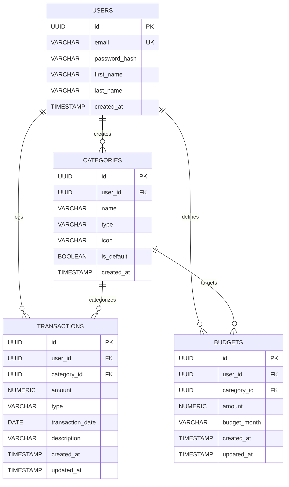

# Database Design & Migrations

## Entity-Relationship Diagram (ERD)

## Tables & Schema Specifications

### `users`
- `id` (UUID, Primary Key)
- `email` (VARCHAR(255), NOT NULL, UNIQUE)
- `password_hash` (VARCHAR(255), NOT NULL)
- `first_name` (VARCHAR(100))
- `last_name` (VARCHAR(100))
- `created_at` (TIMESTAMP, DEFAULT CURRENT_TIMESTAMP)

### `categories`
- `id` (UUID, Primary Key)
- `user_id` (UUID, Foreign Key to `users.id`, NULL for system defaults)
- `name` (VARCHAR(100), NOT NULL)
- `type` (VARCHAR(20), NOT NULL - `INCOME` or `EXPENSE`)
- `icon` (VARCHAR(50))
- `is_default` (BOOLEAN, DEFAULT FALSE)
- `created_at` (TIMESTAMP)

### `transactions`
- `id` (UUID, Primary Key)
- `user_id` (UUID, Foreign Key to `users.id`, ON DELETE CASCADE)
- `category_id` (UUID, Foreign Key to `categories.id`, ON DELETE RESTRICT)
- `amount` (NUMERIC(15, 2), NOT NULL)
- `type` (VARCHAR(20), NOT NULL - `INCOME` or `EXPENSE`)
- `transaction_date` (DATE, NOT NULL)
- `description` (VARCHAR(255))
- `created_at`, `updated_at` (TIMESTAMP)
- **Indexes:** `idx_transactions_user_date` on `(user_id, transaction_date)` for fast filtered lookups.

### `budgets`
- `id` (UUID, Primary Key)
- `user_id` (UUID, Foreign Key to `users.id`, ON DELETE CASCADE)
- `category_id` (UUID, Foreign Key to `categories.id`, ON DELETE CASCADE, NULLABLE)
- `amount` (NUMERIC(15, 2), NOT NULL)
- `budget_month` (VARCHAR(7), NOT NULL, e.g. `'2026-10'`)
- `created_at`, `updated_at` (TIMESTAMP)
- **Unique Constraint:** `uq_user_category_month` on `(user_id, category_id, budget_month)`.

## Migrations History (Flyway)
1. `V1__init_users.sql`: Sets up users table and primary indices.
2. `V2__init_categories_transactions_budgets.sql`: Establishes categories, transactions, and budgets with foreign keys and compound indices.
